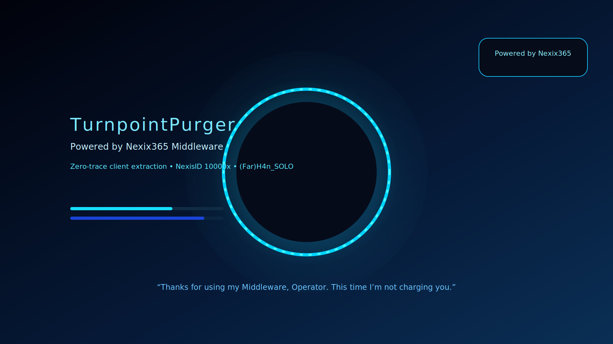

# TurnpointPurger



**Version:** 1.0.0 (TurnpointPurger V1 release)

```
 _____ _    ____   ___   _ _  _   _   ___      ____   ___  _     ___  
|  ___/ \  |  _ \ / / | | | || | | \ | \ \    / ___| / _ \| |   / _ \ 
| |_ / _ \ | |_) | || |_| | || |_|  \| || |   \___ \| | | | |  | | | |
|  _/ ___ \|  _ <| ||  _  |__   _| |\  || |    ___) | |_| | |__| |_| |
|_|/_/   \_\_| \_\ ||_| |_|  |_| |_| \_|| |___|____/ \___/|_____\___/ 
                  \_\                  /_/_____|                      
```

TurnpointPurger (c) (Far)H4n_SOLO is a cinematic Selenium toolkit that logs into TurnPoint, extracts every client artefact, snapshots linked documents, and repackages everything under the sequential “NexisID” archive (`PurgedClients/10000x …`). It ships with both a CLI and a neon Tkinter UI (TurnpointPurger) that show live logs, a Nexix365 badge, and purge history counters.

## Prerequisites

- Python 3.11+ for building/testing.
- Google Chrome installed locally (Selenium Manager fetches the matching driver automatically).
- `.env` file with:
  ```
  TP_USERNAME=...
  TP_PASSWORD=...
  PURGER_CONTACT_EMAIL=you@example.com   # optional, shown inside the GUI
  PURGED_ARCHIVE_ROOT=~/PurgedClients    # optional, overrides where archives are saved
  ```
- Optional: set `TP_OPERATOR` to prefill the operator codename used in logs/UI.

## Installation / Distribution

### macOS (ready-made app)
1. Install dependencies once (this also sets up build helpers):
   ```bash
   python -m venv .venv
   source .venv/bin/activate
   pip install --upgrade pip
   pip install -e .
   pip install pyinstaller
   ```
2. Build the GUI app bundle (outputs to `dist/macos/TurnpointPurger.app`):
   ```bash
   pyinstaller turnpoint_gui.spec
   ```
   or run `python build.py --gui` to install PyInstaller (when missing) and emit the `.app` into the macOS-specific dist folder.
3. Create a DMG (optional) using `hdiutil create -fs HFS+ -volname "TurnpointPurger" turnpoint_purger.dmg dist/TurnpointPurger.app`.
4. Share the `.app` (or DMG) with macOS users. On first launch they may need to right-click → Open to bypass Gatekeeper.

### Windows (portable folder)
1. From an activated virtualenv with project deps installed (`pip install -e .`), build both variants:
   ```powershell
   pyinstaller turnpoint_gui.spec    # windowed GUI (.app inside dist/windows on Win build hosts)
   pyinstaller turnpoint_cli.spec    # console version
   ```
   or just run:
   ```powershell
   python build.py --gui --cli
   ```
   to have the helper install PyInstaller (if needed) and emit binaries under `dist\windows\`.
2. Each build creates a folder under the platform-specific dist directory (e.g., `dist\windows\TurnpointPurger`). Zip that folder to share with operators.
3. Recipients should:
   - Extract the ZIP somewhere writable (e.g., `C:\TurnpointPurger`).
   - Place a `.env` file next to the EXE with their credentials.
   - Run `TurnpointPurger.exe` (GUI) or `TurnpointPurgerCLI.exe`.
   - If SmartScreen warns, choose “More info” → “Run anyway”.

### Installing via pip (developers)
```bash
pip install -e .
turnpoint-purger-gui     # launches UI
turnpoint-purger-cli     # terminal workflow
turnpoint-budgeter       # standalone budget export helper
```

## CLI Usage & Batch Purging
- Running `python importcsv.py` still prompts for a single client ID, but now the CLI stops when a duplicate purge is detected. Pass `--force-duplicate` to override the guard, or `--no-duplicate-prompt` to fail fast without user input.
- To automate multiple clients, provide a CSV manifest (`client_id,client_name,package`). A template lives at `client_manifest.example.csv`; copy it to `client_manifest.csv` or pass the path via `--manifest`.
- Process clients serially per package:
  ```bash
  python importcsv.py --manifest nexis_clients.csv --package "Core Supports" --package "SIL"
  ```
  Packages are consumed in the order provided; each matching client is purged sequentially.
- Purge everyone listed in the manifest (useful for the full 260+ client sweep):
  ```bash
  python importcsv.py --manifest nexis_clients.csv --all-clients
  ```
- Batch runs respect the duplicate guard—clients with an existing purge history are skipped unless `--force-duplicate` is set.

## Packaging Notes
- All output folders live under `~/PurgedClients/` (override via `PURGED_ARCHIVE_ROOT`) with sequential NexisIDs to avoid collisions.
- Duplicate client IDs are detected; the tool emits a `_duplicate_reports/<client>.csv` ledger showing the last purge timestamp before allowing a rerun.
- Persistent stats (`~/.turnpoint_purger/purger_state.json`) drive the UI summary table and CLI logs.
- The build helper writes intermediates to `build/` and final binaries into `dist/<platform>/`. Clean them up between releases with:
  ```bash
  rm -rf build dist __pycache__
  ```

Refer to `PACKAGING.md` for deeper build/customization steps.
