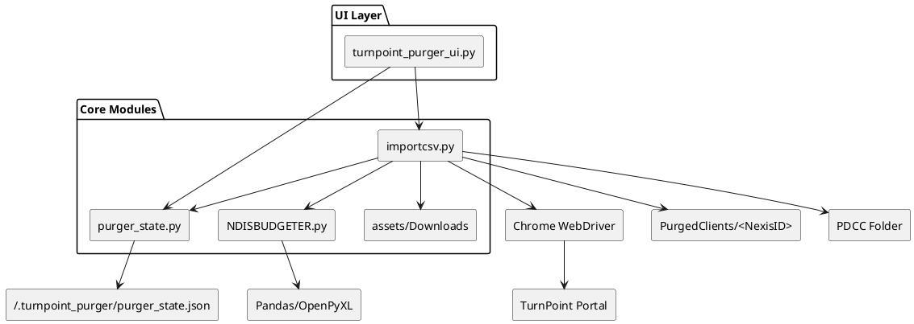

# TurnpointPurger – Engineering Notes

This document captures the end-to-end context so future engineers can onboard quickly, understand expectations from operations, and extend the system safely.

## 1. Mission & Operating Context
- **What it does:** Automates the TurnPoint portal (tp1.com.au) to archive every client artefact (details, schedules, documents, budgets) under sequential “NexisID” folders and exposes a neon Tkinter control surface plus CLI tooling.
- **Key features:** duplicate guard (`PURGED_CLIENTS` JSON + `_duplicate_reports/`), purgeable dataset collector, per-package manifest crawler, bundle exports (Excel + CSV per package under PDCC), NDIS budget parsing (via `NDISBUDGETER.py`), Client Atlas visualisation, and the new NexisUploader tab that converts worker/client archives into Nexis-ready CSV/JSON payloads (with upload automation + CLEANEDFORNEXIS exports).
- **Data roots:**  
  - `PurgedClients/<NexisID CLIENT>` – per-client CSVs, documents, and budget exports.  
  - `~/Purged Client/Package Divided Client Credential (PDCC)` – global artefacts (latest purgeable Excel, per-package bundles, `package_manifest.csv`, `_downloads/`).  
  - `~/.turnpoint_purger/purger_state.json` – universal ID counter + duplicate tracking.

## 2. Build Pipeline (Windows Focus)
1. `python -m venv .venv && .\.venv\Scripts\activate`
2. `pip install --upgrade pip`
3. `pip install -e .`
4. `pip install pyinstaller`
5. *(optional)* `python Declutter.py` to prune `build/`, `dist/`, `egg-info`, `.DS_Store`, `__pycache__`.
6. `pyinstaller turnpoint_gui.spec` → `dist\windows\TurnpointPurger\`
7. `pyinstaller turnpoint_cli.spec` → `dist\windows\TurnpointPurgerCLI\`
8. Alternatively run `python build.py --gui --cli` to populate both directories in one shot.
9. Zip the `dist\windows\TurnpointPurger*` folders and ship them with instructions to place a `.env` beside the EXE (`TP_USERNAME`, `TP_PASSWORD`, `PURGER_CONTACT_EMAIL`, optional `PURGED_ARCHIVE_ROOT`, `PURGEABLE_CLIENTS_URL`).

## 3. Runtime Flow (Backend)
1. **Sequence reservation:** `reserve_universal_sequence` → `assign_universal_sequence`.
2. **Directory prep:** `configure_client_context` (creates working folder + documents dir), `cleanup_old_csvs`.
3. **Driver:** `build_chrome_driver` picks per-run download directory (global working folder or PDCC `_downloads/` for purgeable workflows).
4. **Login & extraction:** `run_turnpoint_purge` logs in once, iterates extractor list (`extract_client_details`, `extract_package_schedules`, `extract_notes`, …) writing CSVs + documents/budgets, updates client name if better value appears, and logs success/failure.
5. **Downloads:** `snapshot_downloads` + `wait_for_new_download` guard chrome downloads; documents hit each `document-details` link; budgets click the Excel button on the NDIS tab; purgeable dataset uses `clients.asp?...fld264=True&psize=10000` and the Excel icon (which fires `generateXL(...)`).
6. **State update:** `record_purge_event` increments counters, stores bytes, timestamp, operator.
7. **Package workflows:**  
   - `find_purgeable_clients` downloads the Excel snapshot (`latest_purgeable_clients.xlsx`).  
   - `bundle_package_download` converts the workbook into `<Package>_clients.xlsx/.csv` under PDCC.  
   - `collect_clients_by_package` loops `clients.asp` with `select[name="fld569"]`, scrapes all `client-details.asp?eid=*`, de-duplicates, and writes `package_manifest.csv`.

## 4. GUI Flow (TurnpointPurger UI)
1. **Layout:** Full-screen Tk window with scrollable root. Left column hosts branding, progress bars, Client Atlas tree view, and the status text. Right column is the Directive Console + Client Discovery buttons. Bottom area is the log panel plus the NexisUploader action hub.
2. **Client Atlas:** On load (and refresh) reads `package_manifest.csv`, applies table tags (`pending` = yellow, `purged` = red) by cross-checking `purger_state`. Reset Purge removes the manifest and reloads the atlas (empty).
3. **Discovery buttons:**  
   - `Collect Package Manifest` → backend crawler.  
   - `Find Purgeable Clients` → downloads the Excel snapshot.  
   - `Bundle Download / Update` → package picker driving `bundle_package_download`.  
   - `Refresh Client Atlas` → simple reload for manual purges.  
   - NexisUploader controls (worker/client scan, CLEANEDFORNEXIS export, FormatforClient CSV regeneration, worker upload automation + JSON preview).  
4. **Purge All Clients:** Reads every client ID from `package_manifest.csv`, purges sequentially, and respects the operator-defined cooldown (entry field defaults to 120 seconds, minimum enforced at 20). The countdown progress bar + override button (“Override cooldown / Force next client”) let ops see/suppress the wait that avoids TurnPoint’s 403 lockout.
5. **Operational timestamps:** Below the manifest/bundle controls the UI now shows “Manifest updated …” and “Bundle last run …” labels plus an indeterminate bundle progress bar. Operators can prove when the datasets were refreshed and know when the next run completes.
6. **Purge Loop:** Engage Purge (or Purge All) spawns `run_turnpoint_purge` in a background thread; UI bars animate, log updates, message boxes reflect success/failure, and duplicate attempts bubble a `DuplicateClientError` toast.

## 5. CLI Flags Outlook
```
python importcsv.py --collect-packages [--package ...]
python importcsv.py --find-purgeable
python importcsv.py --bundle-download
python importcsv.py --update-bundle
python importcsv.py --bundle-package "HCP L1"
python importcsv.py --purgeable-url "https://tp1.com.au/custom-path"
python importcsv.py --manifest my_clients.csv --all-clients
```
All discovery commands accept `--headless`. Use `--purgeable-url` when the tenant-specific clients page differs from the default `fld264=True` URL.

## 6. Troubleshooting Cheatsheet
- **Purgeable click fails (404):** Set `PURGEABLE_CLIENTS_URL` to the known `clients.asp` URL (with `fld264=True`) or pass `--purgeable-url`.  
- **Excel icon hidden:** ensure you’re on `clients.asp` not the dashboard; `_trigger_excel_download` looks for any `<a>` with `onclick='generateXL...'`.  
- **Atlas stays blank:** run `Collect Package Manifest` (creates `package_manifest.csv`), then `Refresh Client Atlas`.  
- **Bundle buttons unresponsive:** they are hidden until credentials are set. After setting, click `Bundle Download`, choose “All Packages” or a single package; watch the log panel for per-package outcomes.

## 7. UML Diagram
The following PlantUML snippet summarises the main modules and interactions:



Use any PlantUML renderer to generate the visual diagram.

---
*Last updated: 2.0.2 – reflects the PDCC manifest workflow, bundle picker UI, purge-all cooldown/override, timestamps, and the corrected purgeable download endpoint.*
