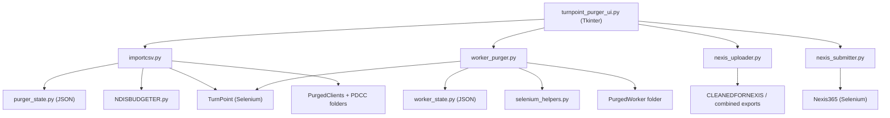

# Architecture and Dataflow

## Architectural style
The codebase is procedural and module-based:
- Browser automation logic lives in Python functions.
- Persistent counters and history live in JSON files.
- The GUI orchestrates backend functions in worker threads.
- Most modules interact via direct imports (no service layer).

There is no external database, API server, or message queue.

## Core component graph

## Client pipeline dataflow (`importcsv.py`)

### Phase 1: Session preparation
- Validate duplicate policy (`guard_against_duplicate`).
- Reserve sequence slot (`reserve_universal_sequence`).
- Build target directories.
- Build Chrome with download preferences.

### Phase 2: TurnPoint extraction
- Login once.
- Visit each target page URL.
- Extract records using page-specific parser.
- Write one CSV per logical page.

### Phase 3: File download
- Document tab:
  - Open each document link in new tab.
  - Click download button via JS.
  - Wait for finished file.
  - Move/rename into documents folder.
- Budget tab:
  - Trigger workbook export.
  - Rename workbook with sequence prefix.
  - Optionally parse workbook into entry CSVs.

### Phase 4: Finalization
- Rename working folder using discovered client name.
- Calculate archive size.
- Persist purge event to state JSON.
- Emit logs and return final path.

## Package discovery + bundle flow

### Purgeable snapshot (`find_purgeable_clients`)
- Navigate to purgeable client URL (default/env/CLI override).
- Set page size (target 10,000 rows).
- Apply purgeable filter.
- Trigger Excel export.
- Store timestamped copy and `latest_purgeable_clients.xlsx` alias.

### Bundle export (`bundle_package_download`)
- Load latest workbook (or refresh first).
- Identify package column.
- Export one CSV + one XLSX per package to PDCC subfolders.

### Manifest crawl (`collect_clients_by_package`)
- Iterate package filter values.
- Trigger search.
- Parse client links with `eid` values.
- De-duplicate client IDs across packages.
- Persist `package_manifest.csv` with deterministic row order.

## Service Type variants dataflow (`appointment_item_discovery.py`)

### Assist entry and readiness
- Login uses shared `importcsv.py` auth helpers.
- Attempt appointment editor routes in order:
  - `tp1` bridge URL (`appointment-edit.asp?...&cid=<probe_client_id>`)
  - direct Assist URL (`https://assist.turnpoint.co/appointments/new`)
  - client appointments page + `Add Appointment` click fallback
- Readiness is PASS only when a Service Type combobox is present and interactable.
- If route/open/readiness fails, capture URL/title/body snippet metadata plus HTML/PNG/console artifacts.

### Locator layer
- Service Type combobox uses multi-strategy fallbacks:
  - `data-testid` selectors
  - `name` selectors
  - `aria-label` selectors
  - `role="combobox"` + ARIA selectors
  - label-adjacent XPath fallback
- Variant table and option list use fallback stacks as well.
- Strategy hits are recorded in diagnostics for postmortem analysis.

### Per-Service-Type extraction loop
- Service Type universe is loaded from reference export first (`ServiceTypes_latest.csv/.xlsx`), then combobox options as fallback.
- For each Service Type:
  - select using retries (`click option`, `reload then click`, `type + enter`)
  - wait for variants table row count to stabilize
  - map table cells as `Service Variant Label`, `Rate`, `Code`, `Unit`
  - write raw and normalized `Rate` + `Code` fields
- Continue-on-error is enforced:
  - write a `Status=FAIL` row with `Error Reason`
  - capture artifacts
  - continue to next Service Type instead of aborting run.

### Output and checkpoint path
- Output root: `~/LineItemRates/ServiceTypeTruth/variants/`
- Files:
  - `latest/ServiceTypeVariants_latest.csv/.xlsx`
  - `snapshots/ServiceTypeVariants_<run_id>.csv/.xlsx`
  - `snapshots/ServiceTypeVariants_conflicts_<run_id>.csv` (if conflicts detected)
- Checkpoints:
  - `checkpoints/checkpoint_<run_id>.json`
  - `checkpoints/variants_append_<run_id>.csv`
- XLSX merges parent columns (A/B) across contiguous variant rows.

## Worker pipeline dataflow (`worker_purger.py`)

### Discovery
- Open carers page.
- Expand search options.
- Set high record limit.
- Trigger search.
- Parse worker links + team labels.
- Save `worker_manifest.csv`.

### Purge
- Check duplicate from worker state.
- Reserve worker sequence ID.
- Open `user-edit.asp?eid={worker_id}`.
- Scrape fields, checkboxes, and radio groups.
- Build normalized worker payload.
- Write three CSV outputs:
  - `WorkerDetail.csv`
  - `Qualification.csv`
  - `Allowance.csv`
- Persist worker event to state JSON.

## Nexis bridge dataflow

### Mapping (`nexis_uploader.py`)
- Discover `*WorkerDetail.csv` files.
- Build `WorkerRecord` objects.
- Transform to Nexis payload fields.
- Apply defaults and normalization rules.

### Submission (`nexis_submitter.py`)
- Login to Nexis.
- Navigate to employees form (direct + fallback path).
- Fill fields by label lookup.
- Click save/submit.

### Batch combine (`combine_cleaned.py`)
- Merge raw worker CSV files.
- Emit combined raw CSV/JSON.
- Emit combined Nexis-formatted CSV/JSON.

## Cross-cutting concerns

### Logging
- `importcsv.log_message` is the shared logger.
- UI injects a log sink callback to stream live output into the text area.
- Service Type variant extraction additionally writes structured diagnostics per run:
  - `events.jsonl` (event schema with code/step/context)
  - `checkers.csv` (pass/fail/warn checkpoints)
  - HTML/PNG/console artifacts for route/readiness/select/extract failures

### State and idempotency
- Client duplicates are explicit and can be overridden.
- Worker duplicates are currently hard-stop skips.
- Sequence IDs are monotonic and persisted.

### Error handling style
- Long-running pipelines use broad exception guards to keep loops alive.
- Most failures are logged and surfaced to UI dialogs.
- Extraction often continues even if one page fails.

## Storage topology
- Client archives: `~/PurgedClients` (or `PURGED_ARCHIVE_ROOT`).
- Worker archives: `~/PurgedWorker` (or `PURGED_WORKER_ROOT`).
- Client package/bundle assets: PDCC path under home directory unless overridden.
- State files:
  - `~/.turnpoint_purger/purger_state.json`
  - `~/.turnpoint_purger/worker_state.json`
